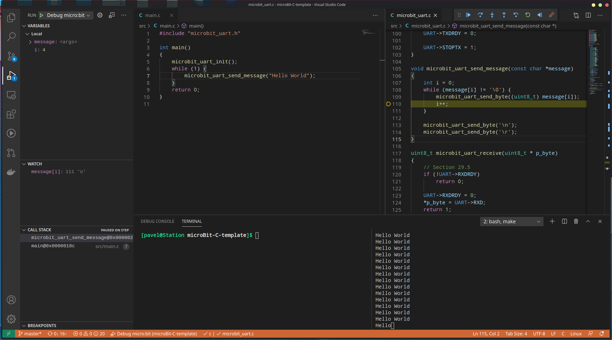

# BBC micro:bit template for C development in VS Code
Template repository for BBC micro:bit development in C with Visual Studio Code. Supports debugging and communication through UART.


## Setup

1. Clone the repo:
```
git clone pavelskipenes/microBit-C-template your-project-name
cd your-project-name
code .
```
2. Install packages:
```
pacman -S arm-none-eabi-gcc arm-none-eabi-gdb openocd picocom 
yay -S nrf5x-command-line-tools
```
3. Confirm that you have packages installed and that they are in path by running:

```
arm-none-eabi-gcc --version | head -n1
arm-none-eabi-gdb --version | head -n1
arm-none-eabi-objcopy --version | head -n1
picocom --help | head -n1
mergehex --version
nrfjprog --version
openocd --version
```

Expected output:
```
arm-none-eabi-gcc (Arch Repository) 10.2.0
GNU gdb (GDB) 10.1
GNU objcopy (GNU Binutils) 2.35.1
picocom v3.1
mergehex version: 10.12.1
nrfjprog version: 10.12.1 
JLinkARM.dll version: 6.94a
Open On-Chip Debugger 0.10.0
Licensed under GNU GPL v2
For bug reports, read
	http://openocd.org/doc/doxygen/bugs.html
```
4. Run `sudo dmesg --follow` and connect micro:bit to the computer.

Expected output:
```
[173366.210957] usb 1-7: new full-speed USB device number 10 using xhci_hcd
[173366.352726] usb 1-7: New USB device found, idVendor=1366, idProduct=1015, bcdDevice= 1.00
[173366.352735] usb 1-7: New USB device strings: Mfr=1, Product=2, SerialNumber=3
[173366.352740] usb 1-7: Product: J-Link
[173366.352746] usb 1-7: Manufacturer: SEGGER
[173366.352751] usb 1-7: SerialNumber: 000787207085
[173366.355200] cdc_acm 1-7:1.0: ttyACM0: USB ACM device
[173366.356264] usb-storage 1-7:1.3: USB Mass Storage device detected
[173366.356740] scsi host6: usb-storage 1-7:1.3
```
Confirm that `ttyACM0` is the device. If not update the device name in `.config/openocd.cfg` and in `makefile`

5. Compile and flash the micro:bit
```
make erase
make flash
make connect
```
You should now get output from the micro:bit in the terminal. You can close picocom by pressing `Ctrl+A`, `Ctrl+x`.

## Debugging
To be able to debug micro:bit in vscode you need to install Native Debug extension and have openocd server running on your computer.

- start openocd server from project root by running: 
```
sudo openocd --file .config/openocd.cfg
```
Expected output:
```
Open On-Chip Debugger 0.10.0
Licensed under GNU GPL v2
For bug reports, read
	http://openocd.org/doc/doxygen/bugs.html
cortex_m reset_config sysresetreq
adapter speed: 1000 kHz
Info : No device selected, using first device.
Info : J-Link OB-BBC-microbit compiled Mar 24 2017 09:33:30
Info : Hardware version: 1.00
Info : VTarget = 3.300 V
Info : clock speed 1000 kHz
Info : SWD DPIDR 0x0bb11477
Info : nrf51.cpu: hardware has 4 breakpoints, 2 watchpoints
```
> Note: You cannot flash micro:bit while openocd server is running due to hardware limitations. You'll need to stop openocd manually each time you want to flash the target.

If you want to avoid typing password when running openocd run this command: 
``` 
sudo chmod u+s /usr/bin/openocd
```
